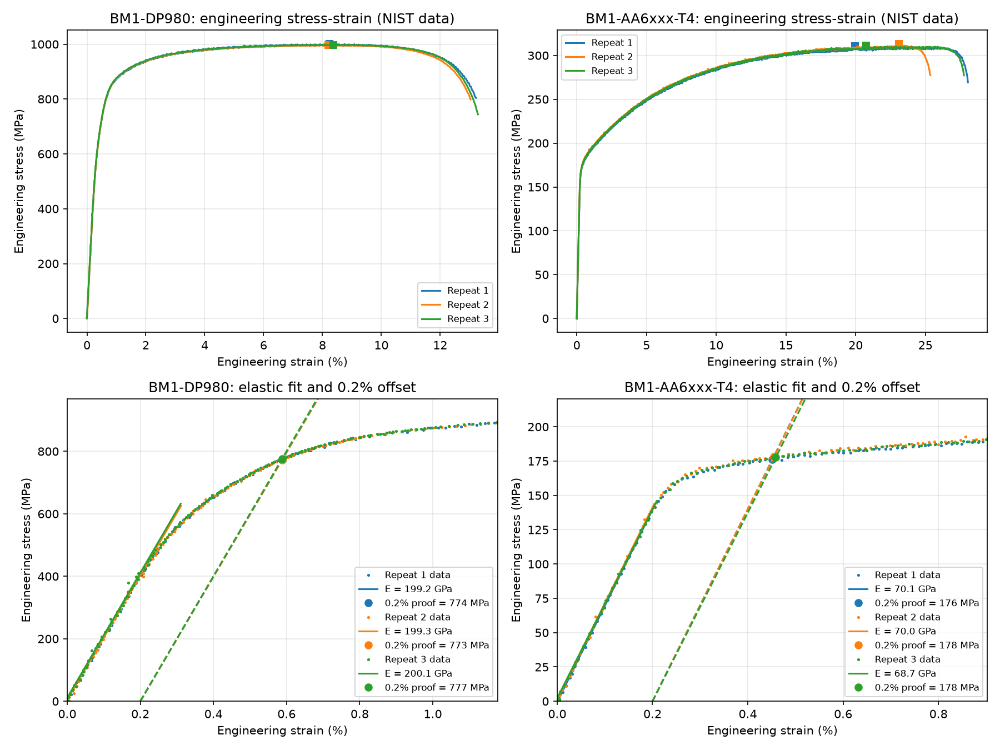

# Tensile Test Analysis Tool

Automatically extracts Young's modulus, 0.2% proof stress, ultimate tensile strength (UTS) and elongation from raw tensile test data. Applied to real test data published by NIST for a dual-phase steel (DP980) and a 6000-series aluminium alloy (AA6xxx-T4), three repeat tests each.

## Data

The data comes from NIST's Numisheet 2020 benchmark: uniaxial tension tests on sheet metal, measured with a load cell and digital image correlation (DIC). Each file records the force and the positions of 201 DIC points tracked along the specimen at every frame of the test. Specimen thickness and width come from NIST's summary table.

Source: NIST, *Data for Numisheet 2020 Uniaxial Tensile and Tension-Compression Tests*, https://data.nist.gov/od/id/mds2-2202

## Method

1. **Strain** – a 50 mm virtual extensometer is built from two DIC points, and engineering strain is the change in distance between them divided by the original 50 mm.
2. **Stress** – force divided by the original cross-sectional area (thickness × width).
3. **Young's modulus** – a straight-line fit (linear regression) to the elastic region, between 10% and 40% of the UTS. The regression standard error gives the uncertainty.
4. **0.2% proof stress** – where the stress-strain curve crosses a line parallel to the elastic fit, offset by 0.2% strain.
5. **UTS** – the maximum engineering stress.
6. **Elongation** – uniform elongation is the strain at maximum load; total elongation is the plastic strain at the end of the test, after removing the elastic part.

## Results

| Material | Repeat | E (GPa) | 0.2% proof (MPa) | UTS (MPa) | Uniform el. (%) | Total el. (%) |
|---|---|---|---|---|---|---|
| DP980 | 1 | 199.2 ± 4.2 | 774 | 1001 | 8.2 | 12.8 |
| DP980 | 2 | 199.3 ± 6.0 | 773 | 996 | 8.2 | 12.6 |
| DP980 | 3 | 200.2 ± 8.8 | 777 | 998 | 8.4 | 12.9 |
| AA6xxx-T4 | 1 | 70.1 ± 1.1 | 176 | 311 | 20.0 | 27.7 |
| AA6xxx-T4 | 2 | 70.0 ± 1.5 | 178 | 313 | 23.1 | 25.0 |
| AA6xxx-T4 | 3 | 68.7 ± 1.2 | 178 | 311 | 20.8 | 27.4 |

(E uncertainties are ± 2 standard errors from the regression.)

- **Accuracy:** the measured moduli are within 1.5% of typical handbook values (about 200 GPa for steel and 69 GPa for aluminium).
- **Repeatability:** across the three repeats, the modulus, proof stress and UTS each vary by less than about 1% for both materials.
- **Elongation scatter:** elongation varies more than strength, as expected, since it depends on exactly where and when necking and fracture happen. The aluminium's stress-strain curve is very flat near its maximum, so the uniform elongation (the strain at peak load) is especially sensitive to small fluctuations, which explains its larger spread.

## Limitations

- The elastic fit window (10–40% of UTS) is a fixed choice. Dual-phase steels start to deviate from linear behaviour early, so the measured modulus depends slightly on the window.
- Only the rolling direction (0°) tests are analysed here. NIST's dataset also includes tests at 15° intervals, which would show anisotropy.
- Total elongation depends on gauge length, so it's only directly comparable to other results using the same 50 mm gauge.

## Next steps

- Analyse the tests at other angles to the rolling direction and calculate the anisotropy (r-values) from the DIC width strains
- Convert to true stress and true strain and fit a hardening law (for example Hollomon or Swift)
- Add the DP1180 steel tests

## Files

- `analyse.py` – reads the NIST data, builds the DIC virtual extensometer, extracts properties and plots the results
- `results.csv` – extracted properties for every test
- `data/` – raw NIST test files and summary table

## How to run

Requires Python 3 with NumPy, SciPy, pandas and Matplotlib.

    py analyse.py